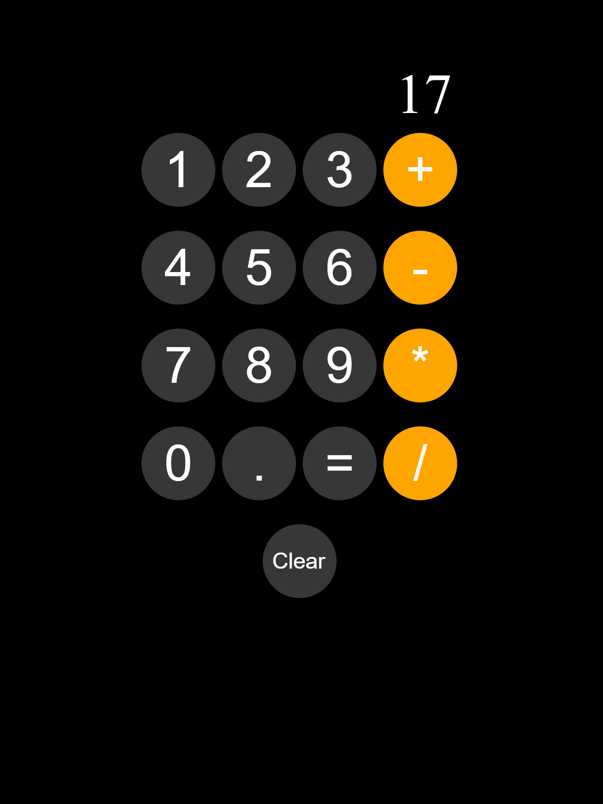

# Calculator

This is a simple calculator web application built using HTML, CSS, and JavaScript. It allows users to perform basic arithmetic calculations such as addition, subtraction, multiplication, and division.

## Features

- Buttons for numbers (0-9) and operators (+, -, \*, /)
- Decimal point button (.)
- Clear button to reset the calculation
- Display area to show the entered calculation and the result

## Getting Started

To use the calculator, simply open the `index.html` file in a web browser.

## Usage

1. Click on the number buttons (0-9) to enter the desired numbers for calculation.
2. Click on the operator buttons (+, -, \*, /) to select the arithmetic operation.
3. Use the decimal point button (.) to include decimal places in your calculation.
4. Click on the equal button (=) to calculate the result.
5. The result will be displayed in the display area.
6. To clear the calculation and start over, click on the clear button.

## Customize

If you want to customize the calculator's appearance or add additional functionality, you can modify the CSS and JavaScript code in the `index.html` file.

- CSS: The calculator's styles are defined in the `<style>` section within the `<head>` tag. You can update the colors, dimensions, or any other visual aspects by modifying the CSS properties.
- JavaScript: The calculator's logic is implemented using JavaScript in the `<script>` section before the closing `</body>` tag. You can enhance the functionality or add new features by modifying the JavaScript code.

## License

This project is licensed under the MIT License. Feel free to use, modify, and distribute the code as per the terms of the license.

## Acknowledgements

The calculator was created as a simple demonstration of HTML, CSS, and JavaScript skills. It was built based on tutorials and examples available online.

## Author

Nick Heal

**Happy calculating!**
